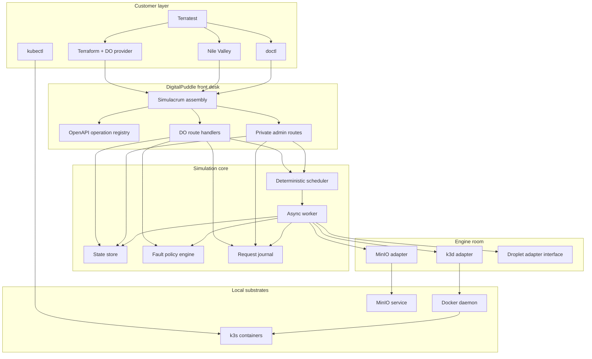

# DigitalPuddle Technical Design

Status: Proposed  
Scope: Define the v1 architecture, contracts, and execution model for a
  DigitalOcean-shaped simulator built on a Simulacrum-based backplane.
Audience: Implementing engineers  
Precedence: Source of truth for design decisions that affect the public v2
  simulation contract and runtime architecture.  
Primary customer: Nile Valley test suites driven through Terratest

## 1. Purpose

DigitalPuddle is a local, contract-focused, DigitalOcean-shaped cloud simulator
whose job is to give Nile Valley a deterministic, hostile, and disposable target
for infrastructure testing. It is not a full DigitalOcean clone. It implements a
strict subset of the DigitalOcean v2 API that Nile Valley actually uses, backed
by a stateful simulation core, an asynchronous transition worker, and a very
small engine room of real local substrates.

The design intentionally keeps **Simulacrum** as the mock backplane.
DigitalPuddle is a DigitalOcean-flavoured sibling to Simulacat Core, not a
bespoke server framework with ad hoc routing.

## 2. Design goals

DigitalPuddle v1 must:

- speak a DigitalOcean-shaped HTTP contract under `/v2`
- let existing clients redirect to it using normal endpoint overrides rather
  than code changes
- model asynchronous control-plane behaviour rather than instant success
- produce deterministic behaviour under a fixed seed and scenario
- expose a first-class request journal for post-run assertions
- provision real local Kubernetes through k3d for fake DigitalOcean Kubernetes
  Service (DOKS)
- provide MinIO as the S3-compatible backend for Terraform state and
  Spaces-shaped workflows
- fail explicitly for unsupported routes instead of faking success
- clean up completely and detect leaks after test teardown

DigitalPuddle v1 must not:

- emulate the entire DigitalOcean product surface
- behave like a hosted or production service
- require real DigitalOcean credentials or internet access during normal
  operation
- proxy or reimplement object-level S3 operations that MinIO already provides
  well
- introduce a new HTTP backplane when Simulacrum already provides the right
  extension seams

## 3. Non-goals

These items are intentionally out of scope for the first meaningful release:

- App Platform, managed databases, load balancers, DNS, volumes, registry,
  monitoring, billing, and the broader DigitalOcean long tail
- QEMU-backed Droplets
- true VPC network isolation
- hosted multi-tenant operation
- production-grade authentication or hardening
- a graphical UI

Droplets may appear in a later slice as either a state-only or container-backed
engine. QEMU is explicitly deferred until Nile Valley demonstrably needs
cloud-init or VM-accurate boot behaviour.

## 4. Core architectural position

DigitalPuddle uses **Simulacrum/foundation-simulator** as the HTTP and routing
backplane, following the same broad pattern as Simulacat Core:

1. parse seeded initial state
2. extend the simulation store with DigitalOcean-specific slices and selectors
3. mount handlers from a pinned DigitalOcean OpenAPI contract
4. add private control routes under a separate namespace
5. drive asynchronous transitions through a deterministic worker

The central assembly should look roughly like this:

```ts
import { simulation } from "@simulacrum/foundation-simulator";

export function createDigitalPuddleApp(args: DigitalPuddleArgs) {
  return simulation({
    apiUrl: "/v2",
    apiSchema: args.apiSchema,
    initialState: args.initialState,
    extend: {
      extendStore: extendDigitalPuddleStore(args.storeOptions),
      openapiHandlers: createDigitalPuddleHandlers(args.runtime),
      extendRouter: registerDigitalPuddleAdminRoutes(args.runtime),
    },
  });
}
```

That is the critical design choice. Simulacrum remains the mixing desk.
DigitalPuddle supplies the DigitalOcean-specific schema, store, handlers,
worker, engine adapters, and admin surface.

## 5. System context

Figure: System context diagram — DigitalPuddle architecture



## 6. Architectural principles

### 6.1 Mock the API, not the cloud’s internals

DigitalPuddle models the DigitalOcean control plane as observed by clients. It
does not attempt to recreate DigitalOcean’s hidden internal systems. Route
shapes, status codes, error envelopes, pagination, and action polling semantics
matter more than deep internal fidelity.

### 6.2 The front desk speaks DigitalOcean; the engine room can cheat

Public handlers accept and return DigitalOcean-shaped HTTP messages. Internal
substrates may be entirely different:

- DOKS is backed by k3d and k3s containers
- Spaces/state storage is backed by MinIO
- future Droplets may be null, container-backed, or QEMU-backed

Clients must never need to know this.

### 6.3 Handlers do not perform infrastructure side effects

Public route handlers may:

- validate input
- read and write simulation state transactionally
- create `Action` rows
- enqueue work
- emit responses

Public route handlers may not:

- call k3d directly
- invoke Docker directly
- create or delete MinIO buckets directly
- shell out to substrate tooling

Only the worker owns side effects.

### 6.4 Determinism is a product requirement

Given the same seed, scenario, and request sequence, DigitalPuddle must produce
the same state transitions and byte-identical request journal. That means:

- no direct calls to wall-clock time in core logic
- no direct use of ambient randomness
- deterministic ID generation
- deterministic fault selection
- deterministic scheduling order

### 6.5 Unsupported behaviour must be explicit

Any unimplemented public route under `/v2` returns a DigitalOcean-shaped
`501 Not Implemented` response. DigitalPuddle must never invent a happy-path
success for a route it does not model.

### 6.6 The journal is not incidental logging

The request journal is a first-class artefact used by tests to assert retry
counts, ordering, idempotency, and leak-free teardown. Operational logs are
useful, but the journal is the product surface.

## 7. Runtime architecture

DigitalPuddle runtime consists of seven major components.

### 7.1 OpenAPI operation registry

DigitalPuddle pins a specific commit of the DigitalOcean public OpenAPI
specification and builds an internal registry of operations. Each operation is
classified as:

- `scriptable`: deterministic state reads, state writes, validation, action
  creation, scheduler work, or worker transitions without an engine adapter
- `engine-backed`: supported workflow logic that requires a worker-owned
  engine-room side effect
- `stubbed`: deterministic static or lightweight behaviour that is explicitly
  not full control-plane modelling
- `unsupported`: intentionally unavailable in this release and mapped to an
  explicit `501` response for matched `/v2` operations

The registry is also the source for a generated capability matrix. That matrix
is part of the implementation contract and should be exposed via the private
admin API. ADR 0007 defines the release capability policy and requires the
runtime lookup, generated documentation metadata, and admin matrix to derive
from one validated classification source. Until the pinned OpenAPI artefact
lands, the v1 seed manifest is the source of truth; after the pin lands, the
same data may decorate operation objects with a DigitalPuddle-owned extension
such as `x-digitalpuddle-capability`.

### 7.2 State store

The store is the single source of truth for simulated resources and runtime
metadata. Two backends are required:

- in-memory for fast tests
- SQLite for persisted runs, replay, and deeper inspection

The store must support atomic transactions around handler writes and worker
transitions.

### 7.3 Deterministic scheduler and async worker

State-changing operations create `Action` rows and enqueue jobs on a
deterministic scheduler keyed by a virtual clock. The worker drains jobs in
virtual-time order and performs state transitions plus any engine-room side
effects.

### 7.4 Fault policy engine

Fault injection is scenario-driven and typed. It can operate both at request
time and transition time. Examples:

- fail the first cluster create with a `500`
- delay a response by simulated latency
- hold a resource in stale-read mode for a fixed window
- saturate rate limits
- return `404` after a successful delete for a bounded period
- hold an action in progress indefinitely or for a long interval

### 7.5 Request journal

The journal records:

- inbound request metadata
- request body
- response status and body
- virtual timestamp and wall timestamp
- fault decisions
- action transitions
- engine adapter calls
- correlation IDs

### 7.6 Engine adapters

The worker uses narrow interfaces for k3d, MinIO, and future Droplet substrates.
Adapters must not leak into public handlers.

### 7.7 Private admin API

Everything needed for orchestration and assertion, but not part of the
DigitalOcean contract, lives under `/_digitalpuddle/*`.

## 8. Public API design

### 8.1 Endpoint strategy

All public endpoints live under `/v2`. The implementation is contract-first:
route shapes and JSON schemas come from the pinned OpenAPI spec, while behaviour
is layered in selectively.

### 8.2 v1 vertical slice

The first meaningful release targets the Nile Valley DOKS path, not the entire
DigitalOcean surface. The recommended v1 public matrix is:

Table 1: Recommended v1 public DigitalOcean endpoints under `/v2`.

| Method | Path                                                | Classification | Notes                                                   |
| ------ | --------------------------------------------------- | -------------- | ------------------------------------------------------- |
| GET    | `/v2/account`                                       | scriptable     | seeded account metadata                                 |
| GET    | `/v2/account/ratelimit`                             | scriptable     | current simulated limits                                |
| GET    | `/v2/regions`                                       | scriptable     | paginated                                               |
| GET    | `/v2/sizes`                                         | scriptable     | paginated                                               |
| GET    | `/v2/images`                                        | scriptable     | paginated                                               |
| GET    | `/v2/ssh_keys`                                      | scriptable     | paginated                                               |
| POST   | `/v2/ssh_keys`                                      | scriptable     | validates public key shape                              |
| GET    | `/v2/ssh_keys/{id}`                                 | scriptable     |                                                         |
| DELETE | `/v2/ssh_keys/{id}`                                 | scriptable     | tombstoned delete semantics                             |
| GET    | `/v2/projects`                                      | scriptable     | paginated                                               |
| POST   | `/v2/projects`                                      | scriptable     |                                                         |
| GET    | `/v2/projects/{id}`                                 | scriptable     |                                                         |
| POST   | `/v2/projects/{id}/resources`                       | scriptable     | attaches existing resources                             |
| GET    | `/v2/projects/{id}/resources`                       | scriptable     |                                                         |
| GET    | `/v2/actions/{id}`                                  | scriptable     | action polling                                          |
| GET    | `/v2/kubernetes/options`                            | stubbed        | static supported versions/options                       |
| GET    | `/v2/kubernetes/clusters`                           | scriptable     | paginated                                               |
| POST   | `/v2/kubernetes/clusters`                           | engine-backed  | provisions k3d-backed cluster                           |
| GET    | `/v2/kubernetes/clusters/{id}`                      | scriptable     | status reflects worker progression                      |
| DELETE | `/v2/kubernetes/clusters/{id}`                      | engine-backed  | tears down k3d cluster                                  |
| GET    | `/v2/kubernetes/clusters/{id}/kubeconfig`           | engine-backed  | returns kubeconfig YAML                                 |
| GET    | `/v2/kubernetes/clusters/{id}/node_pools`           | scriptable     | lists initial pool state created with the cluster       |
| GET    | `/v2/kubernetes/clusters/{id}/node_pools/{pool_id}` | scriptable     | retrieves initial pool state                            |
| any    | other `/v2/*`                                       | unsupported    | explicit `501`                                          |

This is deliberately narrower than the full action plan. It reflects the
assessment that the first release should optimize for Nile Valley’s DOKS path
rather than promise broad DigitalOcean emulation on day one.

The classifications in Table 1 are not merely explanatory. They are the seed
for the machine-readable policy manifest until the pinned DigitalOcean OpenAPI
operation registry is available. Each manifest entry records the method, path
template, operation ID, capability, release stage, product area, and runtime
support metadata needed to build generated documentation, private admin
payloads, and unsupported response lookup data.

### 8.3 Compatibility expectations

DigitalPuddle should work with unmodified clients redirected through endpoint
overrides for supported v1 workflows. ADR 0006 is the normative source for
doctl compatibility and CI coverage.

- Terraform DigitalOcean provider via `DIGITALOCEAN_API_URL`
- Terraform S3 backend or app logic via `SPACES_ENDPOINT_URL` to MinIO
- doctl via explicit `--api-url`
- Nile Valley via its existing client configuration

### 8.4 Response contract details

All public responses must preserve DigitalOcean’s pagination and error-envelope
conventions. Even empty list responses should emit the expected envelope
structure. Rate-limit headers should appear on every response, not only on
`429`.

## 9. State model

### 9.1 Core slices for v1

Recommended v1 store shape:

```ts
type DigitalPuddleState = {
  account: Account;
  regions: Record<string, Region>;
  sizes: Record<string, Size>;
  images: Record<string, Image>;

  sshKeys: Record<number, SshKey>;
  projects: Record<string, Project>;
  kubernetesClusters: Record<string, KubernetesCluster>;
  nodePools: Record<string, NodePool>;
  actions: Record<number, Action>;

  tombstones: Record<string, Tombstone>;
  rateLimits: Record<string, RateLimitWindow>;
  journalCursor: number;
};
```

If Nile Valley later needs Droplets, Spaces access-key metadata, or mutating
node-pool operations through the control plane, those slices can be added as
subsequent vertical slices.

### 9.2 Identifier strategy

Identifiers must be deterministic and resource-appropriate:

- integer-like IDs for resources that clients commonly treat as numeric, such as
  actions and SSH keys
- UUID-like IDs for cluster or project resources if the client surface expects
  them

The implementation should use a seeded ID allocator rather than raw randomness.

### 9.3 Tombstones

Deletes should not instantly erase a resource from simulation history.
DigitalPuddle should track tombstones with expiry times so that clients can
observe realistic post-delete behaviour such as temporary `404` or stale reads.

## 10. Async model and state transitions

### 10.1 Action-driven lifecycle

DigitalOcean-style operations are asynchronous. DigitalPuddle must model this
explicitly.

For cluster creation:

1. handler validates request
2. handler inserts `KubernetesCluster(status = provisioning)`
3. handler inserts `Action(status = in-progress)`
4. handler enqueues `CreateCluster` job
5. handler returns accepted response immediately
6. worker invokes k3d adapter
7. worker stores kubeconfig and endpoint
8. worker updates node pools and cluster status to `running`
9. worker completes the action

### 10.2 Virtual clock

The scheduler should run on a virtual clock by default. The admin API advances
it explicitly, which keeps eventual consistency and delay semantics
deterministic in Continuous Integration (CI).

Required capabilities:

- advance clock by a fixed delta
- drain until idle
- inspect current virtual time
- schedule jobs at future virtual instants

### 10.3 Recommended state machines

Minimal v1 state machines:

- `Action`: `pending -> in-progress -> completed | errored`
- `KubernetesCluster`:
  `provisioning -> running | errored -> deleting -> tombstoned`
- `NodePool`:
  `provisioning -> running -> scaling -> running -> deleting -> tombstoned`

Further resource families can add their own state machines later without
changing the worker architecture.

## 11. Scenario and fault model

### 11.1 Scenario format

Scenarios are typed YAML or JSON files validated against a published JSON
Schema. They are data, not code.

Recommended top-level fields:

```yaml
schemaVersion: 1
name: flaky-doks
seed: 1701
clock:
  mode: virtual
  tickMs: 250
defaults:
  actionDelay: 2s
  eventualConsistencyWindow: 3s
rateLimit:
  hourlyLimit: 5000
  perMinuteLimit: 250
faults: []
```

### 11.2 Fault precedence

Faults should resolve in this order:

1. route-specific override
2. resource-type default
3. scenario global default
4. engine fallback default

This precedence rule prevents scenario ambiguity.

### 11.3 Supported fault primitives

Recommended v1 primitives:

- `fail_first_n`
- `status` and `body` override
- `delay`
- `stale_for`
- `return_404_after_success`
- `stuck_for`
- `rate_limit_override`
- `response_mutation` for narrow contract tests if needed

### 11.4 Example scenario

```yaml
schemaVersion: 1
name: doks-create-with-stale-reads
seed: 1701
clock:
  mode: virtual
  tickMs: 250
rateLimit:
  hourlyLimit: 5000
  perMinuteLimit: 250
defaults:
  actionDelay: 2s
  eventualConsistencyWindow: 3s
faults:
  - match:
      method: POST
      path: /v2/kubernetes/clusters
    behaviour:
      fail_first_n: 1
      status: 500
      body:
        id: server_error
        message: simulated control-plane hiccup
  - match:
      method: GET
      path: /v2/kubernetes/clusters/*
    behaviour:
      stale_for: 5s
```

## 12. Engine room

### 12.1 Kubernetes engine: k3d

DOKS is the main engine-backed surface in v1.

Responsibilities:

- create a k3d cluster when a simulated DOKS cluster is provisioned
- map DigitalOcean node pool counts to k3d agent counts
- capture cluster API endpoint and kubeconfig
- delete the k3d cluster on destroy
- surface any engine error back into the action lifecycle

Recommended implementation approach:

- use the `k3d` CLI through a thin adapter rather than relying on internal APIs
- name clusters with a run-scoped prefix to simplify teardown and leak detection
- keep the mapping deliberately small and unsurprising

### 12.2 Spaces and remote state: MinIO

MinIO should be treated as the real object store for local tests. DigitalPuddle
should not proxy ordinary S3 object traffic. Instead:

- Terraform state or application object operations go directly to MinIO via
  `SPACES_ENDPOINT_URL`
- DigitalPuddle defers `/v2/spaces/keys` access-key management to the Spaces
  access-key control-plane follow-on phase
- MinIO runs as a sibling service in the default compose harness

### 12.3 Droplet engines

Accepted strategy:

- v1: omit Droplet routes and engines, and classify Droplet public API
  operations as unsupported
- follow-on Droplet slice: add `NullDropletEngine` or a small container-backed
  implementation if required
- later: add `QemuDropletEngine` when real host bootstrap semantics matter

This keeps the first release tight.

## 13. Private admin API

All non-DigitalOcean control surfaces live under `/_digitalpuddle`.

The first implemented admin surface is `GET /_digitalpuddle/capabilities`.
It returns the derived capability documentation metadata from the validated
policy manifest: a legend for `scriptable`, `engine-backed`, `stubbed`, and
`unsupported`, plus one visible row per documented operation. Broader state,
journal, scenario, and OpenAPI admin routes remain planned.

Table 2: Recommended private `/_digitalpuddle` harness endpoints.

| Method | Path                                   | Purpose                            |
| ------ | -------------------------------------- | ---------------------------------- |
| GET    | `/_digitalpuddle/health`               | liveness/readiness                 |
| GET    | `/_digitalpuddle/version`              | build info and spec pin            |
| GET    | `/_digitalpuddle/capabilities`         | machine-readable capability matrix |
| GET    | `/_digitalpuddle/state`                | full state snapshot                |
| GET    | `/_digitalpuddle/journal`              | filtered journal query             |
| GET    | `/_digitalpuddle/resources/leaks`      | leak report                        |
| POST   | `/_digitalpuddle/reset`                | reset state and clock              |
| POST   | `/_digitalpuddle/scenario`             | load or replace active scenario    |
| POST   | `/_digitalpuddle/clock/tick`           | advance virtual time               |
| POST   | `/_digitalpuddle/clock/run-until-idle` | drain worker queue                 |
| GET    | `/_digitalpuddle/openapi`              | serve pinned public contract       |

These routes are for harnesses and debugging only. They must not overlap with
`/v2`.

## 14. Request journal

### 14.1 Journal schema

Each entry should include at least:

```ts
type JournalEntry = {
  sequence: number;
  correlationId: string;
  wallTime: string;
  virtualTimeMs: number;
  kind: "request" | "response" | "transition" | "engine-call" | "fault";
  method?: string;
  path?: string;
  operationId?: string;
  resourceType?: string;
  resourceId?: string | number;
  actionId?: number;
  status?: number;
  payload?: unknown;
};
```

### 14.2 Storage format

For v1, JSON Lines is the simplest durable format. Keep it append-only and
human-inspectable. A SQLite-backed index can be added later if query cost
becomes meaningful.

### 14.3 Why it matters

Terratest should be able to ask questions like:

- how many times was cluster create retried?
- did Nile Valley poll the action before fetching kubeconfig?
- did it stop retrying on `422`?
- did teardown leak any clusters or projects?

## 15. Security and trust model

DigitalPuddle is a trusted local developer tool, not a secure multi-tenant
system.

Assumptions:

- scenario files are trusted
- engine adapters are trusted code
- clients run on a developer workstation or isolated CI runner
- any non-empty bearer token is accepted unless a scenario says otherwise

Important caveats:

- mounting the Docker socket grants host-equivalent power to the process that
  can reach it
- DigitalPuddle must not be exposed to untrusted networks
- default operation must make no outbound calls to real DigitalOcean

## 16. Repository layout

A Simulacrum-centred repository should be organized around assembly, store,
handlers, worker, engines, and harnesses rather than around a bespoke web
framework.

```text
src/
  index.ts
  simulation.ts
  config.ts
  openapi/
    index.ts
    capabilities.ts
    registry.ts
    operations.ts
    digitalocean.openapi.json
  store/
    index.ts
    extend-store.ts
    entities/
    backends/
      in-memory.ts
      sqlite.ts
  handlers/
    account.ts
    ssh-keys.ts
    projects.ts
    actions.ts
    kubernetes.ts
    unsupported.ts
    user.ts
  worker/
    scheduler.ts
    clock.ts
    transitions.ts
    faults.ts
    state-machines/
  engines/
    interfaces.ts
    k3d.ts
    minio.ts
    droplet-null.ts
    droplet-container.ts
  journal/
    index.ts
    storage.ts
    queries.ts
    leak-detector.ts
  admin/
    routes.ts
  scenarios/
    schema.ts
    loader.ts
    examples/
  cli/
    index.ts
    commands/
terratest-helpers/
examples/
testenv/
docs/
```

The current transitional implementation has introduced the target homes
incrementally. `src/index.ts` remains the package and build entry facade, while
`src/simulation.ts` owns the Simulacrum server assembly. `src/openapi/index.ts`
re-exports the existing capability policy and projections. Private
DigitalPuddle admin routes are owned by `src/admin/routes.ts`, with
`src/extend-api.ts` kept as the Simulacrum composition facade. The first
extracted inherited REST handlers live in `src/handlers/user.ts`; deeper
GitHub compatibility separation remains a follow-on task. `src/worker/`,
`src/engines/`, `src/journal/`, `src/scenarios/`, and `src/cli/` currently
contain contracts and no-op factories only, so they define boundaries without
claiming scheduler, engine, persistence, scenario loading, or CLI behaviour
that is not implemented yet.

## 17. Testing strategy

### 17.1 Unit tests

Cover:

- store backends
- deterministic ID allocation
- scheduler ordering
- state machines
- fault precedence logic
- journal queries

### 17.2 Contract tests

Contract tests should validate:

- implemented public routes conform to the pinned OpenAPI schema
- pagination envelopes are correct
- error envelopes are correct
- unsupported routes return explicit `501`
- capability matrix projections contain each classified operation exactly once

Only implemented routes and shared contract behaviours should be in scope for
the contract suite. Unsupported routes are not failures if they are explicitly
classified as unsupported.

### 17.3 Integration tests

Bring up the compose stack and verify:

- k3d-backed cluster creation
- kubeconfig retrieval and `kubectl get nodes`
- MinIO accessibility for Terraform state or object operations
- cleanup and leak detection

### 17.4 End-to-end customer test

The key end-to-end path is:

1. `docker compose up -d --wait`
2. run Nile Valley or a representative Terraform example against
   `DIGITALOCEAN_API_URL`
3. retrieve kubeconfig from DigitalPuddle
4. run a Kubernetes smoke test through Terratest
5. destroy resources
6. inspect `/_digitalpuddle/resources/leaks`
7. `docker compose down -v`

### 17.5 Determinism test

A dedicated test must run the same scenario twice with the same seed and assert
byte-identical journals. This is a hard gate.

## 18. Terratest and developer ergonomics

DigitalPuddle should ship a small Go helper module that wraps:

- compose up/down
- wait-for-ready
- scenario loading
- clock advancement
- journal assertions
- leak assertions

The aim is that a Nile Valley engineer can write tests against a stable helper
surface instead of scripting the admin API by hand.

doctl checks should follow ADR 0006 and remain outside the Terratest acceptance
surface for unsupported products.

A canonical test flow should look like:

```go
h := digitalpuddle.Up(t, digitalpuddle.Options{
    ComposeFile: "../testenv/docker-compose.digitalpuddle.yml",
    Scenario:    "../testenv/scenarios/flaky-doks.yaml",
})
defer h.Down(t)

terraform.InitAndApply(t, h.TerraformOptions())
k8s.RunKubectl(t, h.KubectlOptions(), "get", "nodes")
h.Journal().AssertNoLeaks(t)
```

## 19. Release plan

### Phase 1: foundation

- Simulacrum assembly
- pinned OpenAPI registry
- store backends
- deterministic IDs and virtual clock
- request journal
- private health endpoint

### Phase 2: DOKS vertical slice

- account, regions, sizes, images, SSH keys, projects, actions
- cluster create/get/delete
- kubeconfig retrieval
- k3d adapter
- explicit unsupported responses for everything else

### Phase 3: scenario and admin surface

- typed scenario loader
- fault engine
- full admin API
- capability matrix generation
- leak detection

### Phase 4: harness and integration

- compose stack with MinIO
- Terratest helper module
- example Nile Valley integration
- deterministic replay tests

### Phase 5: follow-on slices

- node-pool scale operations
- Spaces access-key control plane
- Droplet slice if required
- optional bucket metadata control plane
- container-backed or QEMU-backed Droplet engines

## 20. Key decisions

Resolved decisions:

- **Use Simulacrum as the HTTP backplane.** Do not replace it with a bespoke
  routing framework.
- **Pin the DigitalOcean OpenAPI contract.** Treat the pin as a release input.
- **Optimize v1 for the Nile Valley DOKS path.** Do not build the whole ocean
  first.
- **Keep the worker deterministic and virtual-time driven.**
- **Use k3d and MinIO as the only real engine-room components in v1.**
- **Make unsupported behaviour explicit and machine-readable.**
- **Make the request journal and leak detector first-class outputs.**
- **Include read-only node-pool state in v1 and defer mutating node-pool scale
  operations.**
- **Use direct MinIO object traffic in v1 and defer `/v2/spaces/keys` access-key
  management.**
- **Omit Droplet routes and engines from v1, then revisit them in a named
  Droplet slice.**
- **Use ADR 0006 as the normative doctl compatibility and CI policy.**
- **Use ADR 0007 as the normative release capability policy.** Keep
  `scriptable`, `engine-backed`, `stubbed`, and `unsupported` classifications
  machine-readable and derive generated docs plus unsupported runtime lookups
  from that source.

Roadmap task 1.1.2 is closed by ADR 0006. The named follow-on phases are
node-pool scale operations, Spaces access-key control plane, and the Droplet
slice.

## 21. Summary

DigitalPuddle should be built as a **Simulacrum-centred, contract-first
DigitalOcean simulator** with a deterministic state store, an asynchronous
worker, a typed scenario system, a first-class journal, and a tiny engine room
composed of k3d and MinIO.

The strongest contribution from the implementation plan is not “more surface
area”; it is the additional discipline around capability classification, spec
pinning, typed scenarios, rate-limit realism, admin control routes, leak
detection, and deterministic replay. Those ideas fit the original architecture
well once they are layered **onto** Simulacrum instead of replacing it.

The practical consequence is a smaller, sharper v1: a hostile but reproducible
fake cloud that teaches Nile Valley the right lessons before it ever touches the
real ocean.
